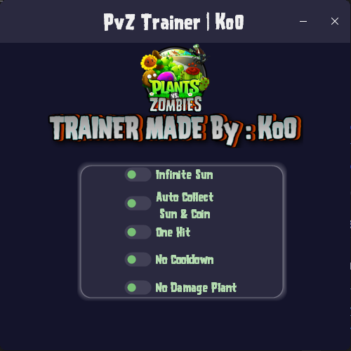

# Plants vs Zombies Trainer

## Table of Contents
1. [Features](#features)
   - [Infinite Sun](#infinite-sun)
   - [Auto Collect Sun & Coin](#auto-collect-sun--coin)
   - [One Hit](#one-hit)
   - [No Cooldown](#no-cooldown)
   - [No Damage Plant](#no-damage-plant)
2. [Installation](#installation)
3. [Usage Instructions](#usage-instructions)
4. [Compatibility](#compatibility)
5. [Troubleshooting](#troubleshooting)
6. [Credits](#credits)

---

## Features

### Infinite Sun
- This feature freezes the sun to its maximum value, allowing you to plant as many plants as you want without worrying about sun limitations.

### Auto Collect Sun & Coin
- Automatically collects suns and coins that are dropped during gameplay, saving you the hassle of having to pick them up manually.

### One Hit
- Instantly destroys zombies' headgear, hand gear, and body with a single hit, making it easy to clear waves of zombies.

### No Cooldown
- Removes the cooldown period for planting plants, enabling you to place them as quickly as you can click.

### No Damage Plant
- Ensures that your plants receive no damage from zombie attacks, allowing them to survive and thrive throughout the game.

---

## Installation
1. Download the <a href="https://github.com/Ragnard-Kiseki/PvZTrainer/releases/latest">trainer</a> and the <a href="https://github.com/Ragnard-Kiseki/PvZTrainer/releases/latest">game</a> file.
2. Extract the contents to a folder on your computer.
3. Run the trainer application as an administrator.
4. Start Plants vs Zombies.

---

## Usage Instructions
- Launch the game before the trainer.
- Toggle the desired features.
- Enjoy!

---

## Compatibility
- Works with Plants vs Zombies (GOTY).
- Not compatible with Plants vs Zombies 2 or any other versions.

---

## Troubleshooting
- If the trainer does not work, ensure that your game is updated to the latest version.
- Try running both the trainer and the game as an administrator.

---

## Credits
- Developed by Ko0  
- GitHub: [Ragnard-Kiseki](https://github.com/Ragnard-Kiseki)  
- Discord: .ko0

---
